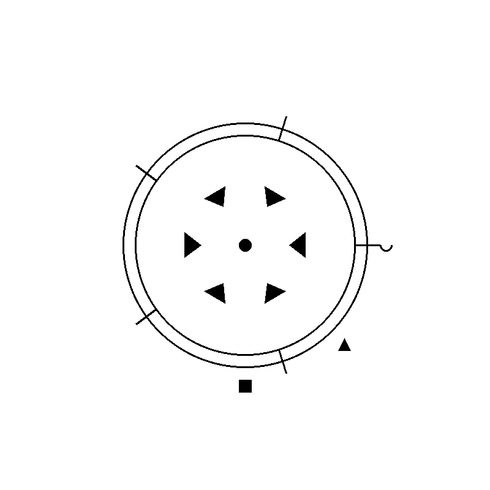
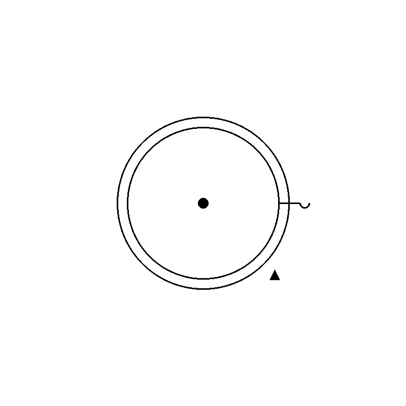
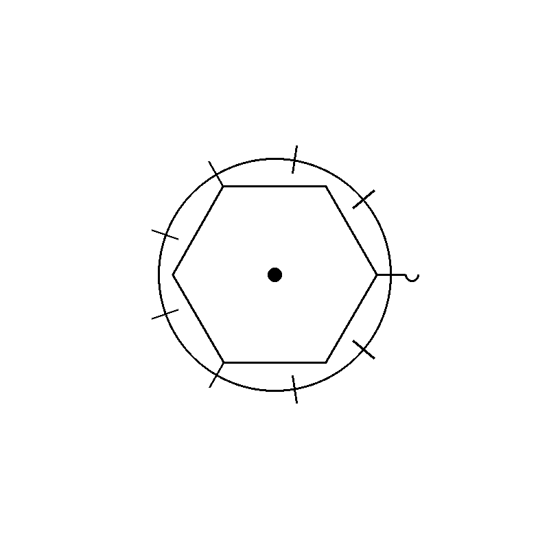

# ✨ GlyphCore ✨

GlyphCore is a Python tool that generates unique, monochrome runes representing spells from *Dungeons & Dragons* 5th Edition. Each rune visually encodes a spell’s properties—such as level, school of magic, damage type, casting time, range, duration, and components—into a stylized, black-and-white glyph. This project is ideal for D&D enthusiasts, game masters, or developers looking to create custom spell representations for campaigns, tools, or artwork.

## 🟢 Features

- **Comprehensive Spell Model**: Encapsulates all D&D spell attributes (level, school, classes, components, etc.) in a `DnDSpell` class.
- **Rune Generation**: The `RuneGenerator` class creates a visual rune for any spell, using shapes, patterns, and symbols to represent its properties:
  - **School of Magic**: Base shape (e.g., circle for Evocation, square for Abjuration).
  - **Spell Level**: Number of radiating lines (e.g., 5 lines for Level 5).
  - **Damage Type**: Internal pattern (e.g., triangles for Fire, dots for Cold).
  - **Casting Time**: Border style (solid for Action, dashed for Reaction).
  - **Range**: Scales the rune size (larger for longer ranges).
  - **Duration**: Central symbol (dot for Instantaneous, spiral for Concentration).
  - **Components**: Edge icons (wave for Verbal, hand for Somatic, diamond for Material).
- **Extensibility**: Supports adding new spells via hardcoded definitions or a JSON file.

## 🔴 Prerequisites

- **Python 3.5+**: Required for `typing` and `enum` support.
- **Pillow**: For image generation (`pip install Pillow` or `pip install -r requirements.txt`).

## 🔵 Installation

1. Clone the repository
2. Ensure the prerequisites are fulfilled
3. Install the required packages with `pip install -r requirements.txt`
4. Run the program with `python3 main.py`

